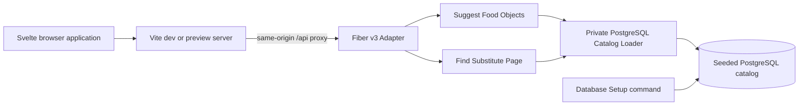

# Obiad Architecture

This document is the source of truth for the current Obiad proof-of-concept architecture. It implements the active requirements in [requirements/requirements.md](requirements/requirements.md).

## System overview

Obiad runs as three local processes: a client-only Svelte browser application, a Go/Fiber backend, and PostgreSQL. Vite serves the browser application and proxies same-origin `/api` requests to Fiber. PostgreSQL owns the seeded Food Catalog.

The browser requests Food Object suggestions and pages of Substitutes through an OpenAPI-first HTTP Interface. Two backend Modules own these operations. Go owns all normalization, ranking, nutrition calculations, paging, and display rounding. The browser owns interaction state, localization, accessibility behavior, and presentation.

## ARCH-001 — Browser Application

| Attribute | Value |
| --- | --- |
| Type | Module |
| Status | Active |
| Requirements | REQ-003, REQ-060–REQ-061, REQ-073, REQ-075, REQ-078–REQ-079 |
| Dependencies | ARCH-002, ARCH-003, ARCH-008, ARCH-014–ARCH-016, ARCH-019–ARCH-021 |

**Responsibility:** Render the single-page substitution interface.

**Contract:** This client-only Svelte 5 Module renders one primary content column. It uses the generated TypeScript HTTP client. It consumes display-ready backend values. It does not implement Search ranking, eligibility, nutrition calculations, paging, or display rounding.

## ARCH-002 — Browser Interaction Module

| Attribute | Value |
| --- | --- |
| Type | Module |
| Status | Active |
| Requirements | REQ-018–REQ-021, REQ-025–REQ-028, REQ-041, REQ-043–REQ-051, REQ-058–REQ-059, REQ-083–REQ-085 |
| Dependencies | ARCH-001, ARCH-003, ARCH-008, ARCH-010–ARCH-012, ARCH-019–ARCH-021 |

**Responsibility:** Own browser interaction transitions.

**Contract:** One discriminated Svelte state owns Search Query text, the selected Food Object, Food Quantity text, page index, focus intent, and motion phase. TanStack Query owns HTTP data, pending state, and request errors. The Module does not copy query results into a Svelte store. A separate persisted store owns the Interface Language.

The state names are `empty`, `loadingNew`, `results`, `loadingMore`, `zeroResults`, `newSearchFailure`, and `moreFailure`. Transitions, not independent booleans, determine visible controls, retained cards, focus, announcements, and motion.

## ARCH-003 — Translation Module

| Attribute | Value |
| --- | --- |
| Type | Module |
| Status | Active |
| Requirements | REQ-013, REQ-026, REQ-044, REQ-050–REQ-051, REQ-055–REQ-059, REQ-068, REQ-083–REQ-085 |
| Dependencies | ARCH-001, ARCH-014 |

**Responsibility:** Produce all localized interface and accessibility text.

**Contract:** Typed static English and Polish dictionaries expose message functions. The Module owns interface labels, validation text, retry text, accessible names, and the existing loading, validation, and failure announcements. It exposes no successful-result count or result-status message. Food Object names remain Food Catalog data.

## ARCH-004 — Suggest Food Objects Module

| Attribute | Value |
| --- | --- |
| Type | Module |
| Status | Active |
| Requirements | REQ-002, REQ-005–REQ-008, REQ-012–REQ-017, REQ-022–REQ-024 |
| Dependencies | ARCH-006, ARCH-013, ARCH-017 |

**Responsibility:** Return the five ranked Food Object suggestions for one Search Query.

**Contract:** One concrete `Run` interface accepts a raw Search Query and an Interface Language. It returns exactly five distinct suggestions or one stable failure. Each suggestion contains the stable Food Object ID, English and Polish names, and a backend-derived default Food Quantity.

The default is `1 serving` when the Food Object has a Serving. Otherwise, it is `100 g` for a solid or `100 ml` for a liquid. The Module exposes no Go interface, repository port, ranking policy, or test Adapter.

## ARCH-005 — Find Substitute Page Module

| Attribute | Value |
| --- | --- |
| Type | Module |
| Status | Active |
| Requirements | REQ-002, REQ-005, REQ-007, REQ-009–REQ-010, REQ-025, REQ-028–REQ-045, REQ-072, REQ-078 |
| Dependencies | ARCH-006, ARCH-013, ARCH-018 |

**Responsibility:** Return one deterministic page of display-ready Substitutes.

**Contract:** One concrete `Run` interface accepts a Substitution Input and a zero-based page index. It returns the requested page index, total eligible count, `hasMore`, the input macronutrients and whole display calories, and at most three Substitute items.

Each item contains the stable Food Object ID, English and Polish names, optional image key, whole Matched Quantity in the candidate base unit, scaled protein, carbohydrate, and fat amounts to 0.1 g, whole display calories, and whole similarity percentage. Page `0` is valid when no eligible Substitute exists. A later page whose first rank does not exist returns `PAGE_OUT_OF_RANGE`. The Module exposes no general Search facade, repository port, policy interface, or test Adapter.

## ARCH-006 — PostgreSQL Catalog Loader

| Attribute | Value |
| --- | --- |
| Type | Module |
| Status | Active |
| Requirements | REQ-002, REQ-004–REQ-010, REQ-070–REQ-072 |
| Dependencies | ARCH-013, PostgreSQL, pgx |

**Responsibility:** Load and validate one request-local Food Catalog snapshot.

**Contract:** This private concrete Module executes embedded SQL through pgx. Its SQL is colocated under `backend/internal/repository/sql/`. It binds all dynamic SQL values through pgx parameters and never interpolates them into statement text; a statement with no dynamic values has no parameters. Each suggestion or Substitution Search performs one fresh PostgreSQL read. The Module maps rows to private Food Object values and reports storage or catalog-invariant failures.

The Module has no exported repository interface, fake Adapter, runtime cache, SQL ranking, automatic retry, or derived-value persistence.

## ARCH-007 — Database Setup Module

| Attribute | Value |
| --- | --- |
| Type | Module |
| Status | Active |
| Requirements | REQ-070–REQ-072 |
| Dependencies | ARCH-013, PostgreSQL |

**Responsibility:** Create the deterministic database state before Fiber starts.

**Contract:** An explicit Go command applies embedded versioned migrations and deterministic seed SQL in transactions. It uses a schema-owner database credential. The command creates the complete POC catalog with fixed IDs and test-designed nutrition values. The request-serving process does not execute DDL or seed operations.

## ARCH-008 — OpenAPI HTTP Interface

| Attribute | Value |
| --- | --- |
| Type | Interface |
| Status | Active |
| Requirements | REQ-001, REQ-012, REQ-025, REQ-036–REQ-037, REQ-050–REQ-051, REQ-055, REQ-058, REQ-074, REQ-078 |
| Dependencies | ARCH-004, ARCH-005, ARCH-019 |

**Responsibility:** Define the browser-to-backend protocol.

**Contract:** A checked-in OpenAPI document is authoritative. It generates Go transport models and the TypeScript client and types. The Fiber Adapter maps generated transport values to backend domain values and maps results back. Generated values do not enter the operation Modules.

The Interface provides these operations:

- `GET /api/v1/food-suggestions?query=<text>&language=<en|pl>`
- `POST /api/v1/substitutes/search`

The POST body contains `foodObjectId`, `quantity.value`, `quantity.unit`, and `pageIndex`. `quantity.value` is a JSON number. `quantity.unit` is `g`, `ml`, or `serving`. The body limit is 4 KiB.

A successful suggestion response contains exactly five items. Each item contains `foodObjectId`, `names.en`, `names.pl`, and `defaultQuantity`.

A successful Substitute response contains `pageIndex`, `totalEligibleCount`, `hasMore`, `inputMacronutrients`, `inputCalories`, and zero to three items. Each item contains `foodObjectId`, both names, optional `imageKey`, `matchedQuantity`, `macronutrients`, `calories`, and `similarityPercent`.

An error response contains a stable `code` and an optional `field`. It never contains localized prose, SQL text, a stack trace, or an internal cause.

| HTTP status | Stable codes |
| --- | --- |
| 400 | `INVALID_REQUEST` |
| 404 | `FOOD_OBJECT_NOT_FOUND` |
| 413 | `REQUEST_BODY_TOO_LARGE` |
| 422 | `INVALID_SEARCH_QUERY`, `QUERY_TOO_LONG`, `UNSUPPORTED_LANGUAGE`, `INVALID_QUANTITY`, `QUANTITY_UNIT_MISMATCH`, `SERVING_UNAVAILABLE`, `QUANTITY_OUT_OF_RANGE`, `INVALID_PAGE_INDEX`, `PAGE_OUT_OF_RANGE` |
| 503 | `CATALOG_UNAVAILABLE` |
| 504 | `SEARCH_TIMEOUT` |
| 500 | `INTERNAL_ERROR` |

## ARCH-009 — Backend Readiness Interface

| Attribute | Value |
| --- | --- |
| Type | Interface |
| Status | Active |
| Requirements | Architecture overhead: deterministic readiness for local and CI orchestration |
| Dependencies | ARCH-006, ARCH-016, PostgreSQL |

**Responsibility:** Report whether Fiber can use PostgreSQL.

**Contract:** Unversioned `GET /health` performs a bounded PostgreSQL ping. It returns `200` with `{"status":"ready"}` only when request processing can use PostgreSQL. It returns `503` with `{"status":"unavailable"}` otherwise. It does not expose configuration, credentials, version data, or dependency details.

## ARCH-010 — Food Suggestion Collaboration

| Attribute | Value |
| --- | --- |
| Type | Collaboration |
| Status | Active |
| Requirements | REQ-012–REQ-013, REQ-018–REQ-024, REQ-077 |
| Dependencies | ARCH-001, ARCH-002, ARCH-004, ARCH-006, ARCH-008, ARCH-017 |

**Responsibility:** Resolve typed Search Queries into selectable Food Object suggestions.

**Participants:** Browser Interaction Module, generated TypeScript client, Fiber Adapter, Suggest Food Objects Module, and PostgreSQL Catalog Loader.

**Runtime behavior:** A focused nonempty Search Query starts a suggestion request. A later query change aborts the stale browser request. Only the latest response can update suggestions. Fiber can continue stale backend work until its deadline because a browser disconnect does not cancel a Fiber handler. The first returned item becomes active. Arrow keys move the active item. Escape closes the list. Tab moves focus. Enter or pointer activation selects the active Food Object.

Selection replaces the Search Query with the exact returned selected name for the active Interface Language, sends the returned default Food Quantity to the Substitution Search operation, and uses page index `0`. A Search Query that is empty after ARCH-017 normalization enables no suggestion request. Enter with that value keeps the exact raw value, Search focus, and current interaction state, shows no validation message, and starts no Substitution Search request.

## ARCH-011 — Substitution Search Collaboration

| Attribute | Value |
| --- | --- |
| Type | Collaboration |
| Status | Active |
| Requirements | REQ-020, REQ-022, REQ-025–REQ-028, REQ-036–REQ-037, REQ-041, REQ-043–REQ-048, REQ-050–REQ-051, REQ-074–REQ-075, REQ-083–REQ-085 |
| Dependencies | ARCH-001, ARCH-002, ARCH-005, ARCH-006, ARCH-008, ARCH-018–ARCH-021 |

**Responsibility:** Coordinate new searches, quantity recalculation, and result-page replacement.

**Participants:** Browser Interaction Module, generated TypeScript client, Fiber Adapter, Find Substitute Page Module, and PostgreSQL Catalog Loader.

**Runtime behavior:** New selection requests page `0`. A quantity edit remains raw local text until Enter or blur. A valid committed value requests the current page. MORE! requests the next page. These operations share one global request lock. Related actions are visibly and accessibly disabled while the lock is held. The system queues no later intent.

A new-search failure clears cards, retains the input, keeps focus in Search, and shows the localized retry state. A MORE! failure retains cards and the control, keeps focus on MORE!, and shows the localized retry state. After a successful new Search or MORE! request with one or more result cards, focus moves to the localized results heading. A successful new Search with zero result cards moves focus to the localized zero-result message. Successful result states emit no result count or result-status live-region message. Existing loading, validation, and failure announcements remain unchanged.

## ARCH-012 — Interface Language Change Collaboration

| Attribute | Value |
| --- | --- |
| Type | Collaboration |
| Status | Active |
| Requirements | REQ-055–REQ-059 |
| Dependencies | ARCH-001–ARCH-003, ARCH-008, ARCH-014 |

**Responsibility:** Change Interface Language without changing current Search identity or order.

**Participants:** Translation Module, Interface Language preference, Browser Interaction Module, and localized Food Object names from HTTP results.

**Runtime behavior:** A valid saved `en` or `pl` preference wins. Otherwise, the browser inspects `navigator.languages` in order and selects the first supported primary language. It defaults to English when none match.

A user selection updates memory and persistence. It closes suggestions, removes focus from the search field, and retains unfinished text. Current result IDs, order, and page remain unchanged. Visible names and all interface and accessibility text change locally without an HTTP request.

## ARCH-013 — Food Catalog Data

| Attribute | Value |
| --- | --- |
| Type | Data |
| Status | Active |
| Requirements | REQ-002, REQ-004–REQ-010, REQ-070–REQ-072 |
| Dependencies | PostgreSQL |
| ADR | [0001 — Store localized names in Food Object JSONB](0001-localized-names-jsonb.md) |

**Responsibility:** Represent the authoritative seeded Food Objects and their nutrition data.

**Owner:** The PostgreSQL schema maintained by ARCH-007.

**Structure contract:** One Food Object row contains:

- one positive opaque seeded integer ID;
- one JSONB localized-name map with nonempty `en` and `pl` string values;
- one Physical State, `solid` or `liquid`;
- finite double-precision protein, carbohydrate, and fat values that are nonnegative and not all zero;
- one optional positive finite Serving base quantity;
- one nullable Food Family foreign key;
- one optional frontend image key.

Additional language keys are permitted in the localized-name map. A solid has a Nutrition Basis of `100 g`. A liquid has a Nutrition Basis of `100 ml`. One separate Food Family row owns only an opaque integer ID. The single nullable foreign key enforces maximum-one flat membership.

**Flow:** ARCH-007 writes migrations and seed data. Fiber uses a separate SELECT-only database credential. ARCH-006 reads the rows for every operation. HTTP results carry only required values. Calories, similarities, Matched Quantities, pages, and rounded card values are derived and are never stored.

## ARCH-014 — Interface Language Preference

| Attribute | Value |
| --- | --- |
| Type | Data |
| Status | Active |
| Requirements | REQ-056–REQ-057 |
| Dependencies | Browser `localStorage` |

**Responsibility:** Persist the selected Interface Language in the browser.

**Owner:** ARCH-003.

**Semantic contract:** The stored value is `en` or `pl`. Other values are invalid and are ignored.

**Flow:** A valid stored value initializes the Interface Language. User selection updates the active value and `localStorage`. Missing or invalid data invokes the browser-language resolution in ARCH-012.

## ARCH-015 — Static Presentation Assets

| Attribute | Value |
| --- | --- |
| Type | Data |
| Status | Active |
| Requirements | REQ-011, REQ-037, REQ-055, REQ-069, REQ-073 |
| Dependencies | Vite frontend bundle |

**Responsibility:** Supply deterministic images and placeholder content without a runtime third party, and define the browser typography fallback contract.

**Owner:** ARCH-001.

**Structure contract:** Bundled Food Object images use opaque image keys. One owner-supplied `512×512` lossless sRGB PNG handles an absent or unusable image. Tailwind declares `Inter, system-ui, sans-serif` for UI text and `Roboto Mono, ui-monospace, monospace` for data and labels. Matching the established mealswapp pattern, `@font-face` resolves system-local Inter across weights `100 900` and Roboto Mono across weights `100 700`; no font file is bundled.

**Flow:** A Substitute response carries an optional image key. The browser resolves a known key to its bundled image. An absent, unknown, or failed image resolves to the placeholder. The browser uses an installed Inter or Roboto Mono family when available, otherwise its declared system fallback, and sends no runtime font request.

## ARCH-016 — Local Three-Process Deployment

| Attribute | Value |
| --- | --- |
| Type | Deployment |
| Status | Active |
| Requirements | REQ-001–REQ-002, REQ-073–REQ-075 |
| Dependencies | ARCH-001, ARCH-007–ARCH-009, ARCH-013, ARCH-015 |

**Responsibility:** Place the POC processes and connect them with the minimum local network surface.

**Placement:** Vite, Fiber v3, and PostgreSQL run as three separate local processes. Chromium connects to Vite. Vite proxies same-origin `/api` requests to Fiber. Fiber connects to PostgreSQL through pgx.

**Runtime constraints:** Bun installs frontend dependencies and runs scripts and tests. Vite owns the development server, production bundle, preview server, and `/api` proxy. Development uses Vite dev. Acceptance, visual, browser-integration, and performance checks use the optimized Vite build through Vite preview.

Fiber listens on loopback only. The POC adds no CORS mechanism, TLS, authentication, cookies, rate limiter, or third-party runtime system. The pgx pool has zero minimum and four maximum connections. Local deployment setup and integration fixtures create separate schema-owner and runtime database users before `dbsetup` runs. They remove `PUBLIC` object-creation and temporary-table privileges. The setup command uses the owner credential. Fiber uses the SELECT-only credential. Credentials are environment-provided and are not committed.

## ARCH-017 — Suggestion Ranking Mechanism

| Attribute | Value |
| --- | --- |
| Type | Mechanism |
| Status | Active |
| Requirements | REQ-012–REQ-015, REQ-017, REQ-076 |
| Dependencies | ARCH-004, ARCH-013 |

**Responsibility:** Produce deterministic suggestion order from a Search Query.

**Behavior:** Validate UTF-8. Normalize the Search Query and compared name to NFC. Trim and collapse Unicode whitespace to ASCII spaces. Apply Unicode lowercase mapping. Reject a normalized Search Query over 128 Unicode code points. Compute raw Levenshtein distance over Unicode code points.

Assign each name to its first applicable exact-match, full-name-prefix, substring, or fallback tier. Sort in that tier order. Within each tier, sort by increasing raw distance, pinned Go collation for the active Interface Language, and stable Food Object ID. Apply no match threshold. A valid seeded catalog therefore returns five suggestions for any nonempty accepted Search Query.

**Quality constraints:** Polish diacritics remain distinct from their base letters. Canonically equivalent Unicode text compares equally. Each candidate receives one tier and one distance calculation. The implementation uses bounded Levenshtein working memory and does not allocate a full distance matrix.

## ARCH-018 — Nutrition and Paging Mechanism

| Attribute | Value |
| --- | --- |
| Type | Mechanism |
| Status | Active |
| Requirements | REQ-007, REQ-009–REQ-010, REQ-025, REQ-028–REQ-035, REQ-038–REQ-043, REQ-072 |
| Dependencies | ARCH-005, ARCH-013 |

**Responsibility:** Calculate eligibility, deterministic Substitute order, page data, and display values.

**Behavior:** Convert the Substitution Input Food Quantity to its base unit. A direct gram or millilitre value is a positive integer. A Serving value can be fractional and multiplies the Food Object Serving base quantity. The converted value must be greater than zero and at most `100,000 g` or `100,000 ml`.

For a Macro Profile `(p, c, f)`, derive calories as `4p + 4c + 9f`. Compute Nutritional Similarity as cosine similarity of the input and candidate Macro Profiles. Exclude the input Food Object and every other member of its Food Family. Sort by decreasing unrounded similarity, pinned English-name collation, and stable Food Object ID.

Count all eligible Substitutes, then slice pages of three. A page contains unique IDs. A nonzero page whose first rank does not exist returns `PAGE_OUT_OF_RANGE`. Compute each selected candidate Matched Quantity at equal derived calories. Scale protein, carbohydrate, and fat to the unrounded Matched Quantity. Round Matched Quantity to a whole base unit, scaled macronutrients to 0.1 g, and `100 × similarity` to a whole percentage. Exact halves round up at each target precision. A positive value can display as zero.

**Quality constraints:** Use `float64` through ranking and calculation. Do not round before response projection. Food Quantity and Interface Language changes do not change eligible IDs, order, or page for an unchanged catalog.

## ARCH-019 — Request Control and Failure Mechanism

| Attribute | Value |
| --- | --- |
| Type | Mechanism |
| Status | Active |
| Requirements | REQ-048–REQ-051, REQ-074–REQ-075, REQ-080, REQ-082 |
| Dependencies | ARCH-002, ARCH-008, ARCH-010–ARCH-011, ARCH-016 |

**Responsibility:** Bound request concurrency, duration, retry behavior, and visible failure transitions.

**Behavior:** Suggestion requests use an independent latest-query lane. The browser aborts a stale request, and a stale response cannot update state. The 450 ms backend context bounds stale Fiber and pgx work that disconnect cancellation does not stop. Substitution Search, quantity recalculation, and MORE! use one global lock. Related actions are disabled while pending. The system queues nothing.

TanStack Query performs no automatic retry. A later identical intent does not reuse a successful response. Each intent starts a real backend request. Fiber derives a 450 ms Go context and passes it through the operation Module to pgx. The frontend aborts at 500 ms. A timeout uses the stable `SEARCH_TIMEOUT` code and the localized retry state. A spinner is absent within 100 ms after request end.

Structured backend logs contain request ID, method, route template, status, duration, stable error code, and internal cause when applicable. They exclude Search Query text, quantities, request bodies, SQL parameters, database credentials, and stack details from HTTP responses.

**Quality constraints:** At most one substitution request and one current suggestion request can affect browser state. Aborted suggestion work can overlap in Fiber, but the 450 ms deadline and four-connection pgx limit bound it. No retry or stale response can extend or mask a visible failure.

## ARCH-020 — Responsive Accessible Presentation Mechanism

| Attribute | Value |
| --- | --- |
| Type | Mechanism |
| Status | Active |
| Requirements | REQ-003, REQ-011, REQ-018–REQ-021, REQ-025–REQ-027, REQ-036–REQ-039, REQ-044, REQ-055, REQ-060–REQ-063, REQ-068–REQ-069, REQ-073, REQ-080–REQ-085 |
| Dependencies | ARCH-001–ARCH-003, ARCH-015 |

**Responsibility:** Present every browser state with the required layout, data, keyboard behavior, focus, and accessibility semantics.

**Behavior:** Tailwind renders one primary content column. The empty state centers the search control. The result state places it near the top and cards below it. The layout uses one card column from 320 px through 1023 px and three columns from 1024 px. Content does not overflow the viewport.

The suggestion control uses the combobox/listbox pattern, active descendant, required key handling, pointer selection, and visible focus. Invalid quantity text remains visible. Enter or blur commits quantity input. Cards show the bundled image or placeholder, localized name, whole Matched Quantity, scaled macronutrients to 0.1 g, and whole similarity percentage. While card values are pending, each card hides its non-image content and shows one centered spinner without changing size. While a MORE! request is pending, its focused control keeps the localized label and uses a gray, `aria-disabled` non-operable presentation.

After a successful new Search or MORE! request with one or more result cards, focus moves to the localized results heading. A successful new Search with zero result cards moves focus to the localized zero-result message. A normalized-empty Enter action retains the exact raw Search Query and Search focus and renders no validation state. Successful result states emit no result count or result-status live-region message. Existing loading, validation, and failure live announcements remain unchanged.

**Quality constraints:** All text and interactive states meet WCAG 2.1 AA contrast. Each control has a localized accessible name and visible focus indication. The required behavior works in latest stable Chromium at 320 px, 768 px, and 1280 px.

## ARCH-021 — Card Motion Mechanism

| Attribute | Value |
| --- | --- |
| Type | Mechanism |
| Status | Active |
| Requirements | REQ-052–REQ-054 |
| Dependencies | ARCH-002, ARCH-020 |

**Responsibility:** Animate result-card appearance and replacement.

**Behavior:** One reusable Svelte transition implementation uses keyed result pages. First-page cards use 220 ms transitions in rank order with 100 ms start intervals. MORE! completes a 120 ms outro before replacement cards start the same entrance sequence.

**Quality constraints:** Reduced-motion mode removes all transition durations and delays. All replacement cards appear together.

## ARCH-022 — Architecture Verification Mechanism

| Attribute | Value |
| --- | --- |
| Type | Mechanism |
| Status | Active |
| Requirements | REQ-070–REQ-075; Architecture overhead: verify all architecture seams |
| Dependencies | ARCH-004–ARCH-011, ARCH-013, ARCH-016–ARCH-021 |

**Responsibility:** Verify the architecture through its real interfaces and Adapters.

**Behavior:** Backend integration tests create a disposable database in real PostgreSQL. They run the real setup command and exercise the real Catalog Loader, operation Modules, and Fiber Adapter. They drop the database after the run. CI provides PostgreSQL as a process.

Every frontend integration test uses the generated client, real Fiber backend, and real PostgreSQL. Normal tests share one seeded stack. Database-outage tests use a separate Fiber process and disposable PostgreSQL database and run serially. Playwright verifies primary flows, accessibility, motion, responsive widths, focus, failure states, and visual states against the complete deployment.

A dedicated serial GitHub Actions job starts the optimized real stack, warms it up, and gates all required 20-request and 20-search timing samples. OpenAPI generation and compilation of generated Go and TypeScript values verify transport consistency.

**Quality constraints:** Tests observe behavior through architecture interfaces. No repository fake is introduced. Unit tests used during development are removed before commit. Timing checks do not share a runner job with parallel test load.

## Requirement coverage

| Requirement | Architecture coverage |
| --- | --- |
| REQ-001 | ARCH-008, ARCH-016 |
| REQ-002 | ARCH-004, ARCH-005, ARCH-006, ARCH-013, ARCH-016 |
| REQ-003 | ARCH-001, ARCH-020 |
| REQ-004 | ARCH-006, ARCH-013 |
| REQ-005 | ARCH-004, ARCH-005, ARCH-006, ARCH-013 |
| REQ-006 | ARCH-004, ARCH-006, ARCH-013 |
| REQ-007 | ARCH-004, ARCH-005, ARCH-006, ARCH-013, ARCH-018 |
| REQ-008 | ARCH-004, ARCH-006, ARCH-013 |
| REQ-009 | ARCH-005, ARCH-006, ARCH-013, ARCH-018 |
| REQ-010 | ARCH-005, ARCH-006, ARCH-013, ARCH-018 |
| REQ-011 | ARCH-015, ARCH-020 |
| REQ-012 | ARCH-004, ARCH-008, ARCH-010, ARCH-017 |
| REQ-013 | ARCH-003, ARCH-004, ARCH-010, ARCH-017 |
| REQ-014 | ARCH-004, ARCH-017 |
| REQ-015 | ARCH-004, ARCH-017 |
| REQ-016 | ARCH-004, ARCH-017 |
| REQ-017 | ARCH-004, ARCH-017 |
| REQ-018 | ARCH-002, ARCH-010, ARCH-020 |
| REQ-019 | ARCH-002, ARCH-010, ARCH-020 |
| REQ-020 | ARCH-002, ARCH-010, ARCH-011, ARCH-020 |
| REQ-021 | ARCH-002, ARCH-010, ARCH-020 |
| REQ-022 | ARCH-004, ARCH-010, ARCH-011 |
| REQ-023 | ARCH-004, ARCH-010 |
| REQ-024 | ARCH-004, ARCH-010 |
| REQ-025 | ARCH-002, ARCH-005, ARCH-008, ARCH-011, ARCH-018, ARCH-020 |
| REQ-026 | ARCH-002, ARCH-003, ARCH-011, ARCH-020 |
| REQ-027 | ARCH-002, ARCH-011, ARCH-020 |
| REQ-028 | ARCH-002, ARCH-005, ARCH-011, ARCH-018 |
| REQ-029 | ARCH-005, ARCH-018 |
| REQ-030 | ARCH-005, ARCH-018 |
| REQ-031 | ARCH-005, ARCH-018 |
| REQ-032 | ARCH-005, ARCH-018 |
| REQ-033 | ARCH-005, ARCH-018 |
| REQ-034 | ARCH-005, ARCH-018 |
| REQ-035 | ARCH-005, ARCH-018 |
| REQ-036 | ARCH-005, ARCH-008, ARCH-011, ARCH-020 |
| REQ-037 | ARCH-005, ARCH-008, ARCH-011, ARCH-015, ARCH-020 |
| REQ-038 | ARCH-005, ARCH-018, ARCH-020 |
| REQ-039 | ARCH-005, ARCH-018, ARCH-020 |
| REQ-040 | ARCH-005, ARCH-018 |
| REQ-041 | ARCH-002, ARCH-005, ARCH-011, ARCH-018 |
| REQ-042 | ARCH-005, ARCH-018 |
| REQ-043 | ARCH-002, ARCH-005, ARCH-011, ARCH-018 |
| REQ-044 | ARCH-002, ARCH-003, ARCH-005, ARCH-011, ARCH-020 |
| REQ-045 | ARCH-002, ARCH-005, ARCH-011 |
| REQ-046 (Deprecated) | Superseded by REQ-080 |
| REQ-047 (Deprecated) | Superseded by REQ-082 |
| REQ-048 | ARCH-002, ARCH-011, ARCH-019 |
| REQ-049 | ARCH-002, ARCH-019 |
| REQ-050 | ARCH-002, ARCH-003, ARCH-008, ARCH-011, ARCH-019 |
| REQ-051 | ARCH-002, ARCH-003, ARCH-008, ARCH-011, ARCH-019 |
| REQ-052 | ARCH-021 |
| REQ-053 | ARCH-021 |
| REQ-054 | ARCH-021 |
| REQ-055 | ARCH-003, ARCH-008, ARCH-012, ARCH-015, ARCH-020 |
| REQ-056 | ARCH-003, ARCH-012, ARCH-014 |
| REQ-057 | ARCH-003, ARCH-012, ARCH-014 |
| REQ-058 | ARCH-002, ARCH-003, ARCH-008, ARCH-012 |
| REQ-059 | ARCH-002, ARCH-003, ARCH-012 |
| REQ-060 | ARCH-001, ARCH-020 |
| REQ-061 | ARCH-001, ARCH-020 |
| REQ-062 | ARCH-020 |
| REQ-063 | ARCH-020 |
| REQ-068 | ARCH-003, ARCH-020 |
| REQ-069 | ARCH-015, ARCH-020 |
| REQ-070 | ARCH-006, ARCH-007, ARCH-013, ARCH-022 |
| REQ-071 | ARCH-006, ARCH-007, ARCH-013, ARCH-022 |
| REQ-072 | ARCH-005, ARCH-006, ARCH-007, ARCH-013, ARCH-018, ARCH-022 |
| REQ-073 | ARCH-001, ARCH-015, ARCH-016, ARCH-020, ARCH-022 |
| REQ-074 | ARCH-008, ARCH-011, ARCH-016, ARCH-019, ARCH-022 |
| REQ-075 | ARCH-001, ARCH-011, ARCH-016, ARCH-019, ARCH-022 |
| REQ-076 | ARCH-004, ARCH-017 |
| REQ-077 | ARCH-002, ARCH-003, ARCH-010 |
| REQ-078 | ARCH-001, ARCH-005, ARCH-008 |
| REQ-079 | ARCH-001 |
| REQ-080 | ARCH-002, ARCH-011, ARCH-019 |
| REQ-081 | ARCH-002, ARCH-019, ARCH-020 |
| REQ-082 | ARCH-002, ARCH-019, ARCH-020 |
| REQ-083 | ARCH-002, ARCH-003, ARCH-011, ARCH-020 |
| REQ-084 | ARCH-002, ARCH-003, ARCH-011, ARCH-020 |
| REQ-085 | ARCH-002, ARCH-003, ARCH-011, ARCH-020 |
